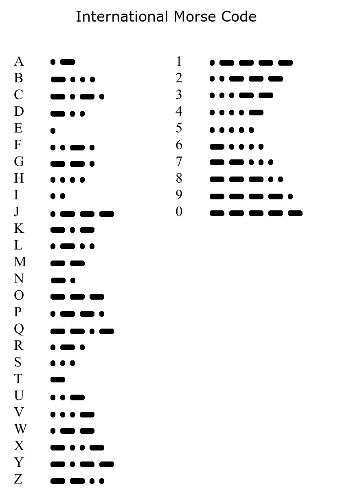

# 🕵🏼 Morse-Code-Converter 🕵🏼
_Simple morse converter using binary tree and hashmap._

***
## Decoder Logic:
Implemented 4 levels of the following tree for decoding.


## Encoder Logic:
Used the hashtable _(alphabets only as of yet)._</br>
<p align="center"></p>

## Input Format:
- Decoder:
  - Use one space to seperate letters and two spaces to seperate words.
  - Put the input string inside quotation marks.
  - example input: ```./morseconverter decode "-.- --- -. .. -.-. .... .. .-- .-"```
- Encoder:
  - Only alphabet conversion supported yet.
  - example input: ```./morseconverter encode "HeY"```

## Build:
1. ```git clone https://github.com/soham0-0/Morse-Code-Converter.git```
2. ```cd Morse-Code-Converter/```
3. ```make all```
